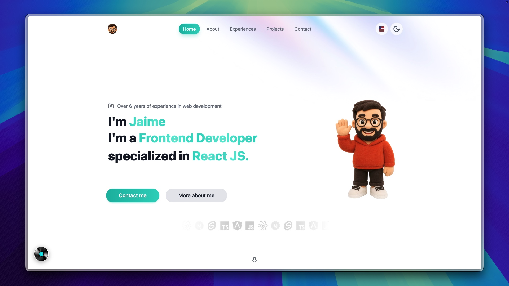

[](https://jaimetorresv.com)

# Portfolio

Personal portfolio built with React 19, showcasing my work as a Frontend Developer — professional experience at companies like Cinepolis, Qrvey, and IA Interactive, along with side projects and open-source tools.

**[Live site](https://jaimetorresv.com)**

## Tech Stack

| Category   | Technology                                                           |
| ---------- | -------------------------------------------------------------------- |
| Framework  | [React 19](https://react.dev) + [Vite 6](https://vitejs.dev)         |
| Styling    | [Tailwind CSS 3](https://tailwindcss.com)                            |
| Animations | [Motion](https://motion.dev)                                         |
| Routing    | [Wouter v3](https://github.com/molefrog/wouter)                      |
| i18n       | Custom context-based system (EN/ES, auto-detected)                   |
| Toasts     | [Sonner](https://sonner.emilkoez.dev)                                |
| Components | [smooth-components](https://www.npmjs.com/package/smooth-components) |
| Images     | [Cloudinary](https://cloudinary.com)                                 |
| Deployment | [Netlify](https://www.netlify.com)                                   |

## Getting Started

```bash
# Clone and install
git clone https://github.com/jaime00/portfolio.git
cd portfolio
npm install

# Start development
npm run dev
```

The app runs at `http://localhost:5173`.

## Scripts

| Command            | Description                      |
| ------------------ | -------------------------------- |
| `npm run dev`      | Development server (Vite)        |
| `npm run build`    | Production build → `dist/`       |
| `npm run preview`  | Preview production build locally |
| `npm run lint`     | Lint source files                |
| `npm run lint:fix` | Lint and auto-fix                |

## Features

- **Dark mode** — class-based toggle with View Transition API, persisted in localStorage
- **i18n** — English and Spanish, auto-detected from browser, switchable at runtime
- **Responsive** — fully responsive with custom Tailwind breakpoints (`min-1045`, `min-445`)
- **Animated icons** — custom SVG icons built with a HOC factory pattern
- **Music player** — integrated vinyl-style music player with playback state persistence

## Project Structure

```
src/
├── animations/    # Shared Motion primitives (variants, easings)
├── assets/        # Local images, animated icon components
├── components/    # Reusable UI components (one folder per component)
├── contexts/      # React contexts (DarkMode)
├── data/          # dataSite.json — projects, experience, site content
├── hooks/         # Custom hooks (useTypewriter, useTilt)
├── i18n/          # Language provider, translation files (en.json, es.json)
├── pages/         # Page components (Home, About, Projects, ProjectDetail, Experiences, Contact)
├── services/      # Data getters (getProjects, getWorkExperience, etc.)
└── styles/        # Tailwind source and custom CSS
```

## License

MIT © [Jaime Torres](https://jaimetorresv.com)

---

## Connect

- [Portfolio](https://jaimetorresv.com)
- [LinkedIn](https://www.linkedin.com/in/jaimetorresv)
- [GitHub](https://github.com/jaime00)
- [Email](mailto:imjaimetorresv@gmail.com)
